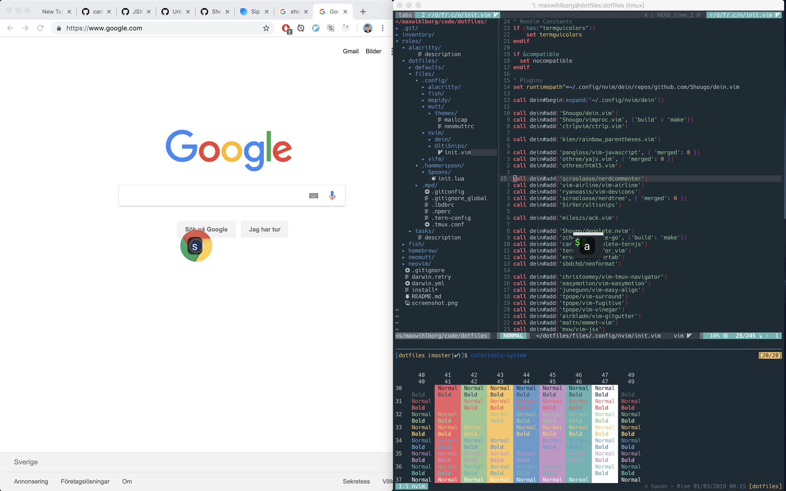

# Dotfiles

Repo where I keep all cross computer configurations, mostly only useful for MacOS.

Keyboard layout created by [Erwan Lemonnier](http://lemonnier.se/erwan/svorak.php)

Programs

- [Hammerspoon](http://www.hammerspoon.org/)
- [NeoVim](https://neovim.io/)
- [Tmux](https://tmux.github.io/)
- [Fish Shell](https://fishshell.com/)

Scripts used

- [tmux-spotify-info](https://github.com/dickeyxxx/tmux-spotify-info)
- [shpotify](https://github.com/hnarayanan/shpotify)

## Screenshot

